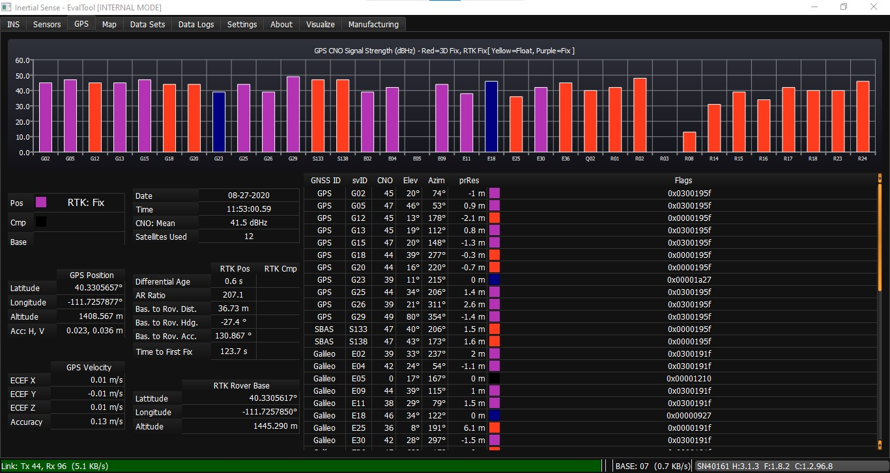

# EvalTool

## Overview

The EvalTool (Evaluation Tool) is a desktop GUI application that allows you to explore and test functionality of the Inertial Sense products in real-time. It has scrolling plots, 3D model representation, table views of all data, data logger, and firmware updating interface for the IMX, uAHRS, or uIMU. The EvalTool can simultaneously interface with multiple Inertial Sense devices.

## Download and Install

The EvalTool Windows desktop app installer (.exe) can be downloaded from the [Inertial Sense releases](https://github.com/inertialsense/InertialSenseSDK/releases) page.

## Getting Started

 

With a device connected to your computer:

1. Connect your INS to your computer using directions in the [getting started](../../../getting-started/getting-started) section of this guide
1. Open the “Settings” tab -> "Serial Ports" tab
1. Click, “Find Devices”
1. Ensure that the checkbox under “Open” is selected for your unit
1. Wait until the box under “Port” turns green and shows a com-port number
1. You can select a specific baud-rate for data transmission on this same tab. This is done in the drop-down menu shown at the top-middle of the page.

#### Data Logging Steps

In order to log data from your INS device, follow the steps listed below:

1. Make sure your unit is connected to the EvalTool and the port is open.
2. Open the “Data Logs” tab.
3. Select “Open Folder” to verify that the log will be saved in your desired location.
4. Change the selection in “Format:” to your desired file format (.dat .csv .sdat etc..)
5. Change the selection in “Data Streams” to the data that you would like collected.
6. Press “Enable” in "Data Log" when you are ready to record the data.
7. The data you are currently recording will be shown in the “Log Summary” sub-tab.
8. When you are finished recording data, press “Disable”. Your data will be saved in the location shown in “Open Folder”.

## Info Bar 

The Info Bar can be seen from any tab and shows basic connection information for the unit selected.

1. Link Status - Shows Packets being Transmitted and Received. counts to 99 then resets to 0. 
2. Error Message - Shows error messages for the selected unit.  The kinds of messages vary from data packets lost to system had a reset.
3. RTK Base Messages - The number in this field will increment as your rover unit continues to receive RTK messages from your base station. Use this field as the main signifier that RTK messages are coming through.
4. Currently selected unit - The unit with the serial number shown here will have its live data shown on each tab in EvalTool.

## Update Firmware

1. Enter the Settings tab.
1. Open the COM ports of the units you would like to update.
	1. If the units don't open up, you may have to change the baud rate.
1. Click "Update Firmware".
1. Choose the firmware file by clicking on the ellipsis (three dots) button next to the file name and navigating to the directory where your .hex file is located. Select it and press "Open".
1. Repeat for the bootloader .bin file or check the bootloader update "Skip" checkbox. The bootloader will only be updated if the unit has an older bootloader than the file provided.
1. Click "Start".
1. Wait for the firmware to fully load or your units will enter into "bootloader mode" and you will have to reload the firmware again.
1. After completion, click "Done".

*Note: The firmware can only be updated at the following baud rates: 300000, 921600, 460800, 230400, 115200.

## Tab Descriptions

### INS Tab

1. Attitude Plot and Table - shows the Roll, Pitch, and Yaw values of the selected unit. Hover the cursor of the radio buttons to see more descriptions. 
1. Velocity Plot and Table - U,V,W velocities.
1. LLA Plot and Table - Tabular values and plot of Latitude, Longitude, and Altitude.
1. Simulation - Real-time, simulated image of the INS orientation.
1. GPS Summary - Strength of GPS signal and accuracy.
1. Mag Recal Button - Allows you to calibrate your units about either a single axis (for heavy, ground based vehicles) or multi-axes.
1. BIT (Built-In Test) Button - Runs a system of checks on your unit.
1. Link Messages - shows the performance information on connected units and displays error messages.

  

### Sensors Tab

 

1. Gyros Plot and Table - Gyroscopic data on the selected unit. Includes standard deviation.
1. Accelerometers Plot and Table - Accelerometer data on the selected unit. Includes standard deviation.
1. Magnetometers Plot and Table - Magnetometer data on the selected unit. Includes standard deviation.
1. Barometer Plot and Table - Barometric, temperature, and humidity data on the selected unit. Includes standard deviation.

### GPS Tab

 

1. GPS CNO Signal Strength - Bar graphs of each satellite being used in your solution and its strength in dBHz(CNO).
1. Position Accuracy Plot and Table - RTK mode and status. Includes number of satellites used in the RTK solution (max and mean).
1. Satellites Used Table - The GNSS ID for each satellite seen by your unit and the subsequent connection details.

### Map Tab

1. Track Active - Tracks all units on window view.
1. Zoom to Fit - Zooms your window view around each unit being used.
1. Manual - Requires manual movement of the window view.
1. Location of Units - GPS location of each of your units. Shows RTK, GPS ublox, and INS solution.

### Data Sets Tab

 

1. List of DIDs (Data IDentifiers) - The data identifiers that you might need to view for measurements. See the User Manual (Binary Protocol Data Sets) for a detailed description of frequently used DIDs.
1. List of Variables within DIDs - shows what is recorded in each DID in real-time.

### Data Logs

#### Data Streams

This area allow users to enable streaming of various DIDs. 

1. RMC Presets Button - Enable a group of data sets.  PPD (post process data) is the preferred preset for post processing and debug analysis.
2. Save Persistent Button - Save currently enabled data streams to automatically begin streaming after system restart. To clear persistent streams, first stop streaming and then click Save Persistent.
3. Stop Streaming - Stops all data streams. Any streams previously saved as persistent will begin streaming at startup. 

#### Data Log

1. Enable/Disable Button - Starts/stops a log of all currently streaming data and saves it to a sub-folder with the current time-stamp within your "Logs" folder.
3. Open Folder Button - Opens the "Logs" folder where your previous logs are saved.
4. Format Dropdown - Select the file output type of the data log , such as .dat, .sdat, .csv, or .kml.
5. Summary Window - Shows the log directly path, the elapsed time the data log has been running, the total size of the log file, and a list currently recording DIDs with corresponding dt (time between measurements).
6. File Conversion Utility - Enables you to convert the data log file type in a specified directory.  (e.g. .dat to .csv)

### Settings Tab

The Settings tab has 3 sub tabs and they are as follows:

**Settings - Serial Ports Tab**

1. Open All - Opens all of the ports shown.
2. Close All - Closes all of the ports shown.
3. Find Devices - Determines which peripherals into your computer are Inertial Sense units, and opens those ports while closing the others.
4. Baud Rate - The rate at which data will be communicated over your data channel.
6. Update Firmware - Allows you to update your unit's firmware when an update is released from Inertial Sense.
7. Port Status - Shows a list of all connected comports and basic information for each of them. Clicking the check box opens the port. 

**Settings - General Tab**

1. Software Reset - Allows the user to issue a reset to the unit. has options for all open comports and only the currently connected unit.
2. Zero Motion - Allows the user to informs the EKF that the system is stationary on the ground and is used to aid in IMU bias estimation which can reduce drift in the INS attitude.
3. DID_Flash_Config - Gives the user option to disable or enable different features normally found in the "Data Sets" tab.  For more information about the Flash Config see [Data sets](../../com-protocol/DID-descriptions/#data-sets-dids).

**Settings - GPS Tab** 

1. IMX Parameters - Shows flash config settings commonly used when setting up RTK units 
1. Status - Shows information important to using RTK.
1. Rover/Base Mode - Used in setup of RTK Rovers and RTK base Stations.
1. Message Window - Shows confirmation messages and Flash Config writes.

### About Tab

Shows General information about the EvalTool and where more help information can be found.

