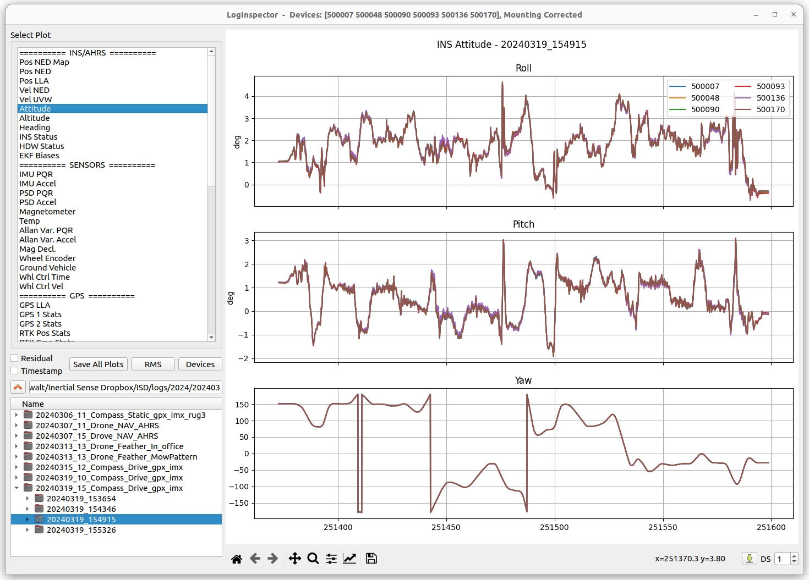

# Log Inspector

## Overview
Log Inspector is an open source python utility for viewing and scrubbing InertialSense data log (.dat) files.

## Getting Started
Log Inspector can open and plot [.dat PPD log files](../../logging-plotting/data_logging/#logging-ppd-in-evaltool). The lower left hand corner file browser allows you to enter a "working directory" in the directory field. The whole directory containing the desired is selected from the directory tree.
Once the log is opened, the buttons in the upper left hand corner are used to graph various data sets.




## Standard data sets

* POS NED Map - Used to plot INS position data in NED frame.

* POS NED - INS position in NED frame.

* POS LLA - INS and GNSS position in LLA.

* GPS LLA - GNSS LLA position.

* Vel NED - Velocity in NED frame.

* Vel UVW - Velocity in body frame.

* Attitude - Euler angle attitude in degrees.

* Heading - Heading data from magnetometer, INS, and RTK.

* INS Status - Plots of status flags vs time.

* HDW Status - plots of hardware status flags vs time.

## Building

**Note** - logInspector requires Python 3.

### Navigate to the Inertial Sense SDK directory

``` bash
python -m pip install logInspector/ # (this will return an error message, but will install all the dependencies you need)
cd logInspector
python3 setup.py build_ext --inplace
```

### Create a config file.

```
C:\Users\[USER]\Documents\Inertial_Sense\log_inspector.yaml
```

### Add the following or similar contents to this file.

```
directory: C:\Users\<username>\Documents\Inertial_Sense\Logs\20181116_SKI\morning_run_1\back\20181116_175352
logs_directory: C:\Users\<username>\Documents\Inertial_Sense\Logs

serials: ["ALL"]
```

## Running

### To run logInspector open a shell and navigate to the logInspector directory and enter the following commands:
``` bash
python3 logInspector.py
```

## Other Directory Contents
The *logInspector* also contains some example implementations for dealing with log files directly in python.

### logReader
This python module is responsible for loading the log file through a pybind11 interface.   All the data in the log is eventually put in the `log.data` array.

### logPlotter
This python module is responsible for creating plots.  Adding new plots is easy, data is directly accessed using the member `logReader` object.

### logInspector
A pyqt5 GUI which uses logPlotter to generate plots.

