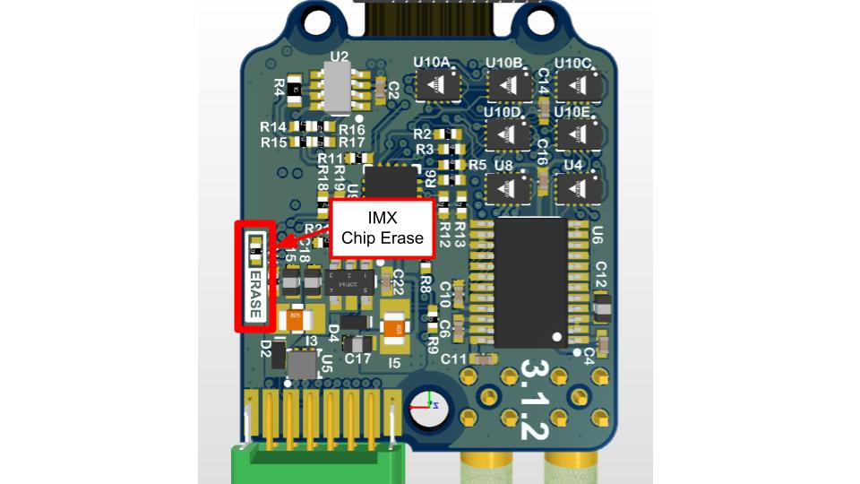
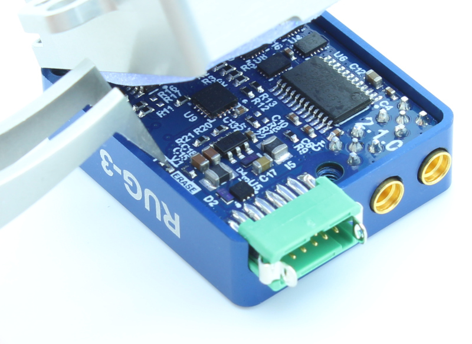

# Chip Erase

Please email [support@inertialsense.com](mailto:support@inertialsense.com) for assistance or to provide feedback on this user guide.

### Steps for Chip-Erase Recovery

!!! warning
    The CHIP ERASE (Reserved (CE) pin 17) erases all flash memory including firmware, settings and calibration.  CHIP ERASE should only be used as a last resort.  This step should ONLY be used if the steps for [Stuck in Bootloader Mode](#stuck-in-bootloader-mode) fail and there is NO other method to recover communications.

!!! important
    Please notify support@inertialsense.com if this step is necessary so that we can keep track of cause of failures and provide you any necessary support.

#### IMX Chip Erase Pad

On the IMX-5, CHIP ERASE is enabled if +3.3V (available on pin 22) is applied to the chip erase (CE) pin 17 during boot up from power cycle or reset.   

**Connect +3.3V to pin 17 (CE) while power cycling the IMX to chip erase IMX.**

#### EVB-2 Chip Erase Pads

**Short R25 pads together to chip erase uINS.
     Short R53 pads together to chip erase EVB-2.**

#### Rugged Chip Erase Pads

The chip erase pads on the Rugged-3 are a set of 0402 SMT pads with the label "ERASE".  Shorting these pads together will apply +3.3V to the IMX chip erase pin 17.  The power must be cycled while shorting these pads in order to apply chip erase to the IMX-5.

**Short "ERASE" pads together and reset to chip erase.**

#### Restore Firmware

1. **Power on system**
2. **Record your IMX Serial Number** - If you can read the serial number, record it for reference.  On older firmware versions the serial number will be erased.  New firmware versions store the serial number in a location that chip erase won't touch.   
3. **Chip Erase IMX** - Assert Chip Erase (Reserved (CE) pin 17) on the IMX longer than 100ms by connecting to +3.3V.  +3.3V is available on pin 2 of all EVB headers.  **Warning!!!** - CHIP ERASE erases all flash memory (including firmware, settings, and calibration) and should only be used as a last resort. This step should ONLY be used if there is NO other method to recover communications.  
4. **Reset the system**
5. [**Enable EvalTool Internal Mode**](#enable-evaltool-internal-mode) - This exposes the "Manufacturing" tab used to upload calibration data.
6. **Restore the application and bootloader firmware** - Use the "Update Firmware" button in the EvalTool Settings tab to load the [bootloader firmware]( https://github.com/inertialsense/InertialSenseSDK/releases/tag/bootloader ) and [IMX firmware](https://github.com/inertialsense/InertialSenseSDK/releases). 

#### Enable EvalTool Internal Mode

EvalTool internal mode is used to access the EvalTool Manufacturing tab, used to restore serial numbers and calibration data.   

1. Close the EvalTool so it isn't running.  
2. Using a text editor, change the value of "DBGINT" to 99 (i.e. `"DBGINT": 99,`) in settings file:  C:\Users\\[USERNAME]\Documents\Inertial Sense\settings.json.
3. Restart EvalTool and verify "[INTERNAL MODE]" is in the title bar.

#### Restore Sensor Calibration

[Contact InertialSense](mailto:support@inertialsense.com) and provide your uINS serial number to request the sensor calibration that corresponds with your uINS.  Use the EvalTool to upload the senor calibration onto your uINS.  

1. Ensure the EvalTool is in [Internal Mode](#enable-evaltool-internal-mode) which provides access the Manufacturing tab.
2. Ensure uINS is communicating with EvalTool.
3. Upload calibration data: EvalTool -> Manufacturing Tab -> "Load" button next to "System Test" button.
4. Verify "TC Pts" which is the number of calibration points located just below the "Load" button changes from "0,0" to two numbers larger than 12 (i.e. "18,18"). 
5. Reset the uINS.
6. **Run "Built-In Test"**  - Verify the built-in test passes by pressing the "Built-In Test" button in the EvalTool INS tab.
7. **Verify IMU output** - Place the uINS on a flat level surface.  Using the EvalTool Sensor tab, verify that the gyro rates are near zero, the accelerometer X and Y axes are near zero, and accelerometer Z axis is near -9.8m/s^2 for gravity.

