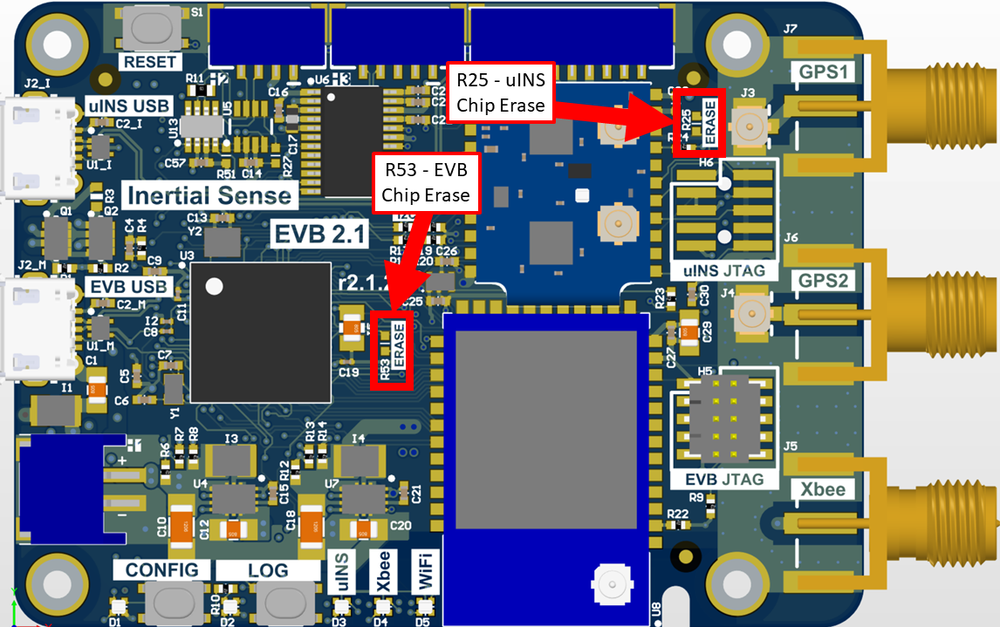

# Firmware Troubleshooting

Please email [support@inertialsense.com](mailto:support@inertialsense.com) for assistance or to provide feedback on this user guide.

## Data doesn't look right
If the EvalTool or SDK are from a different release from the firmware on the unit, there may be communication protocol related issues. It's best to keep both the software and firmware in sync with each other. The EvalTool should flag a protocol mismatch in the settings tab.

## Bootloader Not Responding
Check the following:

- The input supply is at 3.3V and clean without noise.
- The serial connection is grounded (no floating grounds).
- The serial wires between the uINS module and the next active device (buffer, converter, or processor) are not longer than 1 meter when bootloading firmware.

## Bootloader Update fails first time

If updating the bootloader firmware and using the USB direct connection on the uINS module (pins 1 and 2) or the EVB-2 (EVB USB connector), the serial port number will change when the device switches from application mode to Bootloader Update mode.  This is expected and requires reselecting the new serial port and running the Bootloader Update process a second time. 

## System in AHRS mode despite GPS messages being received

If attempting to enter NAV mode but the system reports AHRS despite GPS data beig received, then assure your units are not set to Rover RTK mode. This will override your ability to lock in GPS Nav mode.

## "Bricked" System Recovery
There are different reasons a system may appear unresponsive and not communicate.  The following sections describe how to recover a system from these states.  

!!! attention
​	The ONLY indicator that the bootloader is running is the fading cyan module LED.  NO communications will appear in the EvalTool or CLTool.  **Attempt to update the firmware before performing a chip erase.**

!!! attention
​	Hardware v3.1.3 and firmware IS_uINS-3_v1.2.1.0_b287_2017-09-17_103826.hex and older will not communicate and require following these instructions to be recovered. Do NOT use the chip erase procedure for this scenario.

### Stuck in Bootloader Mode

In some cases, the bootloader may fail to completely update firmware.  This is indicated by the fading cyan status LED on the uINS module.  This can happen if older bootloader firmware is on the uINS and firmware version 1.7.1 is uploaded.  If this happens, the system will appear to be unresponsive in the EvalTool.  The following process can be used to recover the system to a working state:

If the **bootloader is running**, identified with the fading cyan color LED on the uINS module, following these steps:

1. **Ensure uINS Firmware is Running** - *(This step is not necessary if the uINS firmware is running and the EvalTool is communicating with the uINS)*.  Select the device serial port and update the firmware using [1.6.4](https://github.com/inertialsense/InertialSenseSDK/releases/tag/1.6.4) or earlier.  If the bootloader is running, version information will not appear in the EvalTool.  The following bootloader update step will not work unless the EvalTool is communicating with the uINS firmware.
2. **Update the Bootloader** - Use the EvalTool "Update Bootloader" button in the Settings tab to upload the latest [bootloader firmware](https://github.com/inertialsense/InertialSenseSDK/releases/tag/bootloader).  If it has a fading cyan color on the uINS module, the bootloader is running and ready for new firmware to be loaded. **The bootloader can only be updated using serial0 or the native USB connection.**
3. **Update the Firmware** - Use the EvalTool "Update Firmware" button to upload the [latest uINS firmware](https://github.com/inertialsense/InertialSenseSDK/releases).

If neither the bootloader or the uINS firmware are running, identified with the solid or no LED status on the uINS module, please [contacts us](mailto:support@inertialsense.com).

### Recovery for Firmware v1.2.1.0

Hardware v3.1.3 and newer and firmware IS_uINS-3_v1.2.1.0_b287_2017-09-17_103826.hex and older result in a system that runs but will not communicate properly.  This older firmware was not designed for the newer hardware and consequently runs the processor at a slower speed, which alters all of the predefined baud rates to non-standard irregular baud rates.  A symptom of this problem is the LED flashing to indicate the processor activity and the module never communicates properly. 

The following steps are provided to recover communications with the system. 

1. Install and run the [hotfix release 1.1.3 EvalTool](https://github.com/inertialsense/InertialSenseSDK/releases/download/1.1.3/EvalTool.Installer.r1.1.3.2018-06-08.221942.exe).  
2. Select the special baud rate **560,000** in the EvalTool and open the serial port.
3. Update the firmware using any version **newer than** IS_uINS-3_v1.2.1.0_b287_2017-09-17_103826.hex.

The latest EvalTool, CLTool, SDK, and firmware can be used once the firmware has been updated on the module.

### Steps for Chip-Erase Recovery

!!! warning
    The CHIP ERASE (Reserved (CE) pin 17) erases all flash memory and should only be used as a last resort. This step should ONLY be used if the steps for [Stuck in Bootloader Mode](#stuck-in-bootloader-mode) fail and there is NO other method to recover communications.  

!!! important 
    Please notify support@inertialsense.com if this step is necessary so that we can keep track of cause of failures and provide you any necessary support.

**Short pin 17 to pin 22 to chip erase uINS.**

**Short R25 pads to chip erase uINS.
     Short R53 pads to chip erase EVB-2.**

#### Restore Firmware

1. **Power on system**
2. **Record your uINS Serial Number** - If you can read the serial number, record it for reference.  On older firmware versions the serial number will be erased.  New firmware versions store the serial number in a location that chip erase won't touch.   
3. **Chip Erase uINS** - Momentarily assert Chip Erase (Reserved (CE) pin 17) on the uINS module longer than 100ms by connecting to +3.3V.  +3.3V is available on pin 2 of all EVB headers.  **Warning!!!** - CHIP ERASE erases all flash memory and should only be used as a last resort. This step should ONLY be used if there is NO other method to recover communications.  
4. **Reset the system**
5. [**Enable EvalTool Internal Mode**](#enable-evaltool-internal-mode) - This exposes the "SAM-BA" button and "Manufacturing" tab.
6. **Restore the bootloader firmware** - Open the device serial port and use the "SAM-BA" button in the EvalTool Settings tab to load the [bootloader firmware]( https://github.com/inertialsense/InertialSenseSDK/releases/tag/bootloader ).
7. **Restore the uINS firmware** - Open the device serial port and use the "Update Firmware" button in the EvalTool Settings tab to load the [uINS firmware](https://github.com/inertialsense/InertialSenseSDK/releases). 

#### Enable EvalTool Internal Mode

EvalTool internal mode is used to access the EvalTool Manufacturing tab, used to restore serial numbers and calibration data.   

1. Close the EvalTool so it isn't running.  
2. Using a text editor, change the value of "DBGINT" to 99 (i.e. `"DBGINT": 99,`) in settings file:  C:\Users\\[USERNAME]\Documents\Inertial Sense\settings.json.
3. Restart EvalTool and verify "[INTERNAL MODE]" is in the title bar.

<!-- COMMENT OUT FOLLOWING BECAUSE MOST PEOPLE DON'T NEED TO DO THIS

#### Restore Serial Number

!!! warning
    Assigning the serial number (manufacturing info) can only be done once.  If you get it wrong, you will need to do a chip erase and restore all contents again.  

The serial number has been reset and needs to be reassigned if it shows up as "SN4294967295".  Use the following steps for this:

1. Ensure the EvalTool is in [Internal Mode](#enable-evaltool-internal-mode) which provides access the Manufacturing tab.
2. Check "Manf. Info" and set the SN field with the correct serial number. 
3. Uncheck all other options in the "Step 1 - Program & Test" area (as shown in the picture).
4. Press "Program & Test".
5. Verify the correct serial number is displayed in the EvalTool.

-->

#### Restore Sensor Calibration

[Contact InertialSense](mailto:support@inertialsense.com) and provide your uINS serial number to request the sensor calibration that corresponds with your uINS.  Use the EvalTool to upload the senor calibration onto your uINS.  

1. Ensure the EvalTool is in [Internal Mode](#enable-evaltool-internal-mode) which provides access the Manufacturing tab.
2. Ensure uINS is communicating with EvalTool.
3. Upload calibration data: EvalTool -> Manufacturing Tab -> "Load" button next to "System Test" button.
4. Verify "TC Pts" which is the number of calibration points located just below the "Load" button changes from "0,0" to two numbers larger than 12 (i.e. "18,18"). 
5. Reset the uINS.
6. **Run "Built-In Test"**  - Verify the built-in test passes by pressing the "Built-In Test" button in the EvalTool INS tab.
7. **Verify IMU output** - Place the uINS on a flat level surface.  Using the EvalTool Sensor tab, verify that the gyro rates are near zero, the accelerometer X and Y axes are near zero, and accelerometer Z axis is near -9.8m/s^2 for gravity.

## Troubleshooting with EvalTool

### Units Not Connecting

In the case that your units do not connect properly to the EvalTool, verify:

1. The baud rate is the same that you previously had when the Com Ports last opened correctly.
2. The LED on the unit is not showing solid white, flashing white, or solid red. These mean a failure occured in loading the bootloader (see User Guide for full LED descriptions).
3. If you are using a USB3.0 connection, the com port might take longer to show up than with USB2.0
4. Check your computer's Device Manager to see if your unit shows up there. If it doesn't show up, you may have an FTDI driver issue.
   1. If you suspect you don't have the FTDI driver installed on your Windows computer, use the following links to download the driver:
      - Executable for the FTDI USB driver:
        - http://www.ftdichip.com/Drivers/CDM/CDM21228_Setup.zip
      - Drives without executable.
        - http://www.ftdichip.com/Drivers/D2XX.htm

## 1.7.6 Bug RTK Base GPS Raw work around

If you are having base raw errors on your Rover, in the bottom right of the Evaltool, or a climbing Diffrential Age, in Data Sets DID_GPS1_RTK_REL, you maybe having this bug. Try this workaround.

1. Go-to settings tab, open the Base serial COM port.
2. Go-to Data Logs tab, under RCM Presets dropdown select PPD.
3. **NOTE:** You must leave the comport open on the Base.
4. Check your Rover to see if its still getting raw errors messages.

