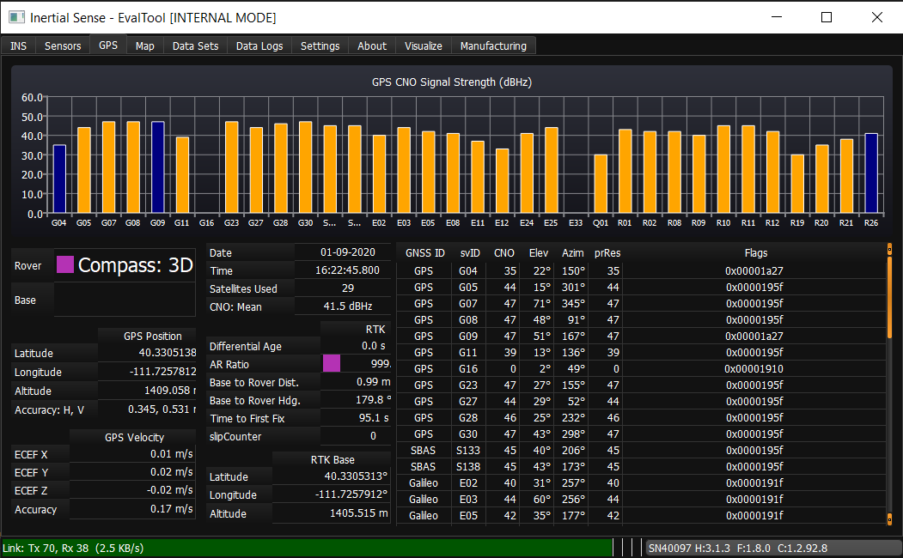

# IMX Firmware Troubleshooting

## Antenna Baseline
Separation between GNSS antennas (or baseline distance) impacts the accuracy and fix time of the solution. Typical Dual GNSS heading fix time is 60-90 seconds using a 1 meter baseline. Baseline distances shorter than 1 meter will impact both heading accuracy and time to fix. However, having a short baseline of 0.35m should not cause an extremely long fix time.

**ITEM TO TEST:** Try increasing the antenna baseline to 0.5m or greater during initial testing.

## Satellite CNO Strength, RFI and EMI
What is the satellite CNO (signal strength) level? The mean CNO would ideally be above 38-40. Anything lower could indicate the presence of RF interference (RFI) or electromagnetic interference (EMI). You can see this in the EvalTool GPS tab or the DID_GPS1_POS message.

**ITEM TO TEST:** Try powering off portions of the system while running the IMX. You may even try running the IMX independently to a separate computer to monitor the system so you can completely power off your system with the IMX still running. Pay close attention to the GPS CNO during each change.

## USB Interface
USB-3 has been known to interfere with wireless and GNSS systems. It is the most common source of interference that has been experienced. Properly shielded cables or signal filters can address this.

**ITEM TO TEST:** Disable USB-3, digital busses, or various switching supplies and observe the satellite CNO level. CNO mean should be near or above 40 dB/Hz.

## Antenna Ground Planes
The ground planes should be adequately sized. Larger ground planes help but are generally not the root cause of poor performance. Separate and common ground planes are both acceptable.

**ITEM TO TEST:** Try doubling the ground plane below the antenna. A simple sheet of metal placed below the antenna is fine. This is also not likely the root cause but worth testing.

## Antenna Cable Ground Loops
In come cases the GNSS antenna cable can form an electrical loop and cause interfere.

**ITEM TO TEST:** Try to ensure cables never loop back or are bundled. If possible shorten cables to smallest required length. Monitor GPS CNO before and after.

## Local Interference
In some cases we have seen object in close proximity to the GNSS antennas act as a multi-path surface, reflect GNSS signals onto the GNSS antennas. Ensure no objects are near the antennas above the plane of the antennas.

## Antenna Orientation
A more accurate heading can be achieved if the GNSS antennas have the same antenna orientation (point the same way). You should consider rotating one or both GNSS antennas so the coax cable exit in the same direction on each antennas.

|                           Mismatch                           |                            Match                             |                            Match                             |
| :----------------------------------------------------------: | :----------------------------------------------------------: | :----------------------------------------------------------: |
|  |  |  |