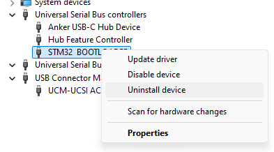
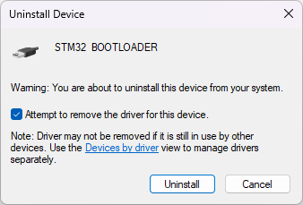
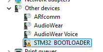
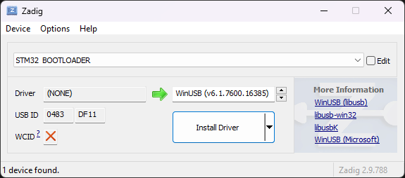
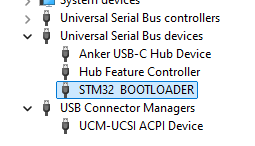

# IMX-5 Bootloader

## Windows USB Device Driver

In some cases updating the IMX-5 bootloader firmware (not the IMX-5 application firmware) will fail in Windows if the wrong device driver is used.  The following instructions show how to install the correct device driver using the **Zadig generic USB driver installer** Windows application.

### Steps to Update IMX Windows Device Driver

When updating the bootloader, the IMX-5 will switch into ROM bootloader mode and communicate using DFU protocol over USB.  In this mode the device is identified in the Window Device Manager as `STM32 BOOTLOADER`.  This device will only appear in the Device Manager when the IMX-5 is in ROM bootloader mode and connected via USB.  This device will not appear in the Device Manager during normal operation or when not connected over USB.   

**STEP 1 - Uninstall Old Device Driver** - To uninstall the device driver, right click and select "Uninstall device" on the `STM32 BOOTLOADER` device.  

**NOTE:** To see the device in the device manager, the IMX-5 should be connected over USB and the IMX-5 in ROM bootloader mode.  Run the firmware update with bootloader **Force Update** option to enable ROM bootloader mode on the IMX-5. 

Delete the old device driver files by selecting **Attempt to remove the driver for this device** or **Delete driver files** checkbox and click **Uninstall**.

**STEP 2 - Install New Device Driver** - Download and run the [Zadig USB driver installer](https://zadig.akeo.ie/).  The Zadig USB driver installer detects the device that needs the driver installed.  The `STM32 BOOTLOADER` device must appear in the Windows Device Manager for this to work.  When there is no device driver installed, the `STM32 BOOTLOADER` device will appear under **Other devices** in the Windows Device Manager.

Run the Zadig generic USB driver application.  Select update online and make sure `STM32 BOOTLOADER` is selected in the top dropdown menu.  `WinUSB *=*v(6.1...` should appear in the driver option list.  Click **Install Driver** and wait about one minute for the process to finish. 

The `STM32 BOOTLOADER` device will appear in the Device Manager under **Universal Serial Bus devices** when the device driver is properly installed.

Attempt the firmware update to test the newly installed device driver.

**NOTE:**  The negotiation at the beginning of the IMX-5 bootloader update can be interrupted if the IMX-5 receives data on other ports than that used for the update (i.e. from a connected GPS receiver).  If this happens, the firmware update will fail but can be re-run.  To prevent interruption so that the bootloader update occurs in one process, data stream into other ports of the IMX must be turned off.  

