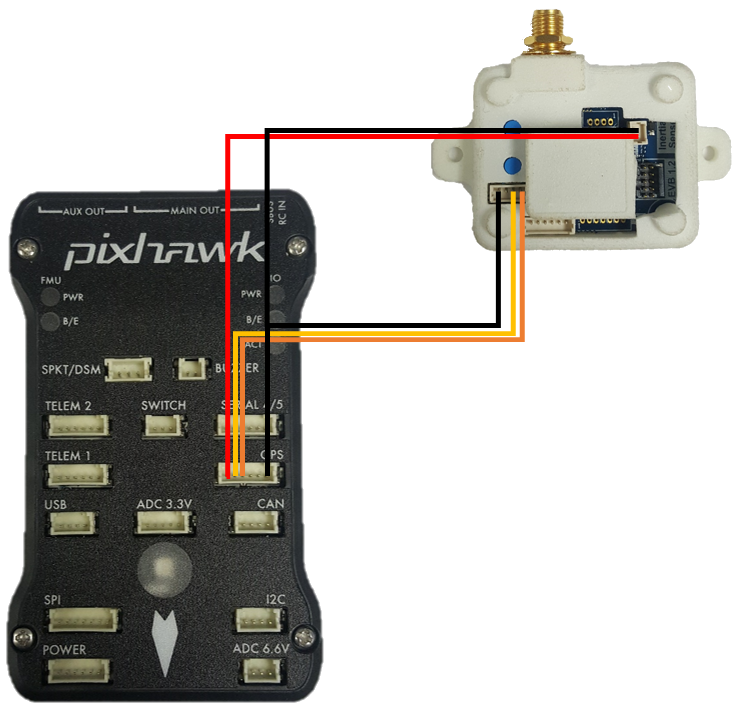

# Pixhawk Integration

<font color="red" size="5"><b>NOTE: PIXHAWK CONNECTIVITY IS IN BETA.<br> FIRMWARE AVAILABLE ONLY ON REQUEST.</b></font>

When connected to the Pixhawk, the InertialSense acts as a GPS receiver to the Pixhawk. If using a uINS, it supplies the position and velocity estimate from the full inertially-aided solution, rather than just GPS to the PixHawk as a GPS sensor, increasing accuracy beyond even the most capable GPS receiver. If the InertialSense is paired with an RTK ground station, it supplies the inertially-aided RTK GPS solution to the Pixhawk, further increasing accuracy.

!!! info
​    Currently the Pixhawk is only supported with the PX4 firmware. As of 1/26/2018, you'll need to use our custom fork of the pixhawk firmware.

## Building the Pixhawk firmware

First, clone the custom firmware and check out the inertialsense branch

```bash
git clone https://github.com/inertialsense/Firmware.git
cd Firmware
git checkout inertialsense
```

Now, we need to pull down the right submodules

```bash
git submodule update --init --recursive
```

!!! warning
    Be sure to checkout the `inertialsense` branch before trying to update your submodules.  Otherwise, your submdules are going to turn into a huge mess

Then, build the firmware, using the appropriate target. The targets are listed on the PX4 documentation on building the PX4 from source https://dev.px4.io/en/setup/building_px4.html. We have so far only tested on the Pixhawk 1, but it should likely work on all other valid targets

```bash
make px4fmu-v2_default ## change target based on hardware
```

and it will build

## Uploading Firmware

Append upload to the make commands to upload the compiled binary to the autopilot hardware via USB. For example

```bash
make px4fmu-v2_default upload
```

Connecting InertialSense as GPS to Pixhawk

Connecting the InertialSense to the PixHawk is just connecting the Rx and Tx Lines from the H4 connector of the InertialSense to the Tx and Rx lines of the GPS.

Apply 5V power to the 2-pin H1 port on the PixHawk as shown below.

!!! warning
    The VCC pin on H4 is _not_ 5V Tolerant. Applying 5V to this pin will fry the chip.

